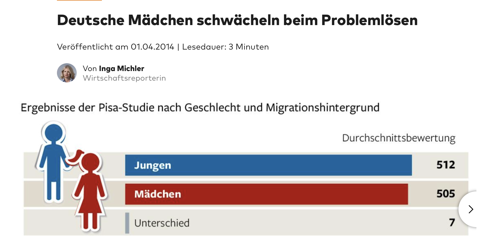
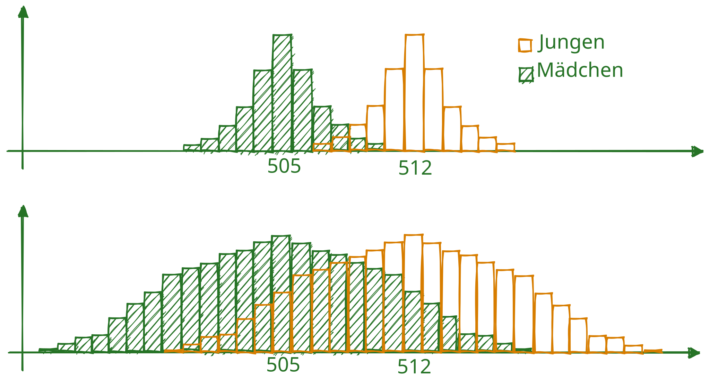

## Inhalte dieses Vorlesungsblocks {.smaller .center}

```{r hidden chunk which creates template stuff}
#| echo: false

library(fontawesome)
library(tidyverse)
library(exams2forms)
```

. . .

[]{.imp} Informationsgehalt von Effektstärken

. . .  

[]{.imp} Effektstärken für Gruppenunterschiede (Cohen's $U_1$, $U_3$ und $d$)

. . .

[]{.imp} Effektstärken für zwei nicht-normalverteilte (z.B. ordinale) Variablen (Cliff's $d$)


## <!--Informationsgehalt von Effektstärken--> {.center .smaller}
[ Informationsgehalt von Effektstärken]{.em15 .c .imp}


## Informationsgehalt von Effektstärken {.center .smaller}
::: {.r-stack}
{.fragment fragment-index=1 width="35%" fig-align="center"}

{.fragment fragment-index=2 width="68%" fig-align="center"}

{.fragment fragment-index=3 width="33%" fig-align="center"}

{.fragment fragment-index=4 width="60%" fig-align="center"}
:::

. . .

<center>Artikel aus ARD [-@zotero-item-9353], FAZ [-@2018a], psychologie-lernen.de [-@psychologie-lernen.de2023] und Welt [-@2015a]</center>

## Informationsgehalt von Effektstärken {.center .smaller}
{width=70% fig-align="center"}  

<center>
Zum Informationsgehalt von Mittelwertsdifferenzen.
</center>


## Überlappung vs. Mittelwertsdifferenz
```{shinylive-r}
#| standalone: true
#| viewerHeight: 500

library(shiny)
library(ggplot2)
library(dplyr)
library(tidyr)
library(Hmisc)
library(munsell)
library(thematic)
library(bslib)
library(shinyWidgets)
library(bayestestR)
library(viridis)


ui <- fluidPage(
      theme = bs_theme(
  #    heading_font = font_google("Source Sans Pro"),
  #    base_font = font_google("Source Sans Pro"),
      preset = "shiny",
  #   bg = "#ffffff",
  #   fg = "#000",
     primary = "#267326"
      ),
 # titlePanel("Überlappung vs. Mittelwertsdifferenz"),
  
  sidebarLayout(
    
    # Sidebar with a slider input
    sidebarPanel(
      sliderInput("sample_n", "Größe der Stichprobe", 1, 800, 164),
      sliderTextInput(
        inputId = "form",
        label = "Verteilungsform", 
        choices = c("1 = umgekehrt u-förmig", 
                    2:9, 
                    "10 = u-förmig"),
        selected = "4"
      ),
      sliderTextInput(
        inputId = "overlap",
        label = "Überlappung", 
        choices = c("1 = (fast) keine", 
                    2:9, 
                    "10 = (fast) völlständige"),
        selected = "6"
        
      ),
      numericInput("mean1", "Mittelwert Gruppe 1", 508),
      numericInput("mean2", "Mittelwert Gruppe 2", 512), 
      selectInput(
        "plottype",
        "Art der Visualisierung",
        c("Histogramm" = "Histogramm",
          "Dotplot" = "Dotplot",
          "Densityplot" = "Densityplot",
          "Violinplot" = "Violinplot",
          "Sinaplot" = "Sinaplot",
          "Jitterplot" = "Jitterplot",
          "Boxplot" = "Boxplot",
          "Errorbarplot" = "Errorbarplot"))
      ),
 
  mainPanel(
      uiOutput("plotUI")
  )
  )
)


server <- function(input, output, session) {
  
  shape1_shape2 <- reactive({
    case_when(input$form == "1 = umgekehrt u-förmig" ~ 20,
              input$form == "2" ~ 16,
              input$form == "3" ~ 12,
              input$form == "4" ~ 8,
              input$form == "5" ~ 4,
              input$form == "6" ~ 2,
              input$form == "7" ~ 1,
              input$form == "8" ~ .7,
              input$form == "9" ~ .4,
              input$form == "10 = u-förmig" ~ .2)
  })
  
  range_diff <- reactive({
    case_when(input$overlap == "1 = (fast) keine" ~ 2,
              input$overlap == "2" ~ 1.5,
              input$overlap == "3" ~ 1,
              input$overlap == "4" ~ .8,
              input$overlap == "5" ~ .6,
              input$overlap == "6" ~ .5,
              input$overlap == "7" ~ .4,
              input$overlap == "8" ~ .3,
              input$overlap == "9" ~ .2,
              input$overlap == "10 = (fast) völlständige" ~ .1)
  })

  mean_diff <- reactive({
    abs(input$mean1 - input$mean2)
  })
  
  # adapt data to input
  data1 <- reactive({
    tibble(G1 = distribution_beta(input$sample_n,
                                   shape1_shape2(), 
                                   shape1_shape2()),
           G2 = distribution_beta(input$sample_n,
                                   shape1_shape2(), 
                                   shape1_shape2()))
  })
  
  range_emp <- reactive({max(data1()$G1) - min(data1()$G1)})
  
  data <- reactive({
    tibble(
      G1 = (data1()$G1 - .5) / (max(data1()$G1) - .5) *  # centering and range =1
            mean_diff() * 1/range_diff() + 0.5 + input$mean1,
      G2 = (data1()$G2 - .5) / (max(data1()$G1) - .5) *  # centering and range =1
            mean_diff() * 1/range_diff() + 0.5 + input$mean2
    ) %>% 
      gather(Gruppe, Ausprägung)
  })
  
  
  output$plot <- renderPlot({
    
    
    if (input$plottype == "Dotplot")
      plot <-
        ggplot(data(), aes(x = Ausprägung, 
                           fill = Gruppe)) +
        labs(title = "Dotplot") +
        geom_dotplot(
          method = "histodot",
          color = "#ffffff00") +
        theme_minimal(base_size = 18) +
        scale_fill_manual(values = c("#26732690", "#d77d0090")) 
    
    if (input$plottype == "Histogramm")
      plot <-
        ggplot(data(), aes(x = Ausprägung, 
                           color = Gruppe, 
                           fill = Gruppe)) + 
        geom_histogram(color = "#26732600",
                       position="identity") +
        theme_minimal(base_size = 18) +
        labs(title = "Histogramm") +
        theme_minimal(base_size = 18) +
        scale_fill_manual(values = c("#26732690", "#d77d0090"))
    
    if (input$plottype == "Boxplot")
      plot <-
        ggplot(data(), 
               aes(x = Ausprägung, y = Gruppe)) + 
        geom_boxplot(color = "#267326",
                     fill = "#26732620") + 
        theme_minimal(base_size = 18) +
        labs(title = "Boxplot")
  
    if (input$plottype == "Jitterplot")
      plot <-
        ggplot(data(), 
               aes(x = Ausprägung, y = Gruppe)) + 
        geom_jitter(color = "#267326") + 
        theme_minimal(base_size = 18) +
        labs(title = "Jitterplot") 
    
    if (input$plottype == "Densityplot")
      plot <-
        ggplot(data(), aes(x = Ausprägung, 
                           color = Gruppe, 
                           fill = Gruppe)) + 
        labs(title = "Densityplot") +
        theme_minimal(base_size = 18) +
        scale_fill_manual(values = c("#26732650", "#d77d0050")) +
        scale_color_manual(values = c("#267326", "#d77d00")) +
        geom_density() 
      
    
    if (input$plottype == "Violinplot")
      plot <-
        ggplot(data(), 
               aes(x = Ausprägung, y = Gruppe)) + 
        geom_violin(color = "#267326",
                     fill = "#26732620") + 
        theme_minimal(base_size = 18) +
        labs(title = "Violinplot")
    
    if (input$plottype == "Sinaplot")
      plot <-
        ggplot(data(), 
               aes(x = Ausprägung, y = Gruppe)) + 
        ggforce::geom_sina(color = "#267326",
                    fill = "#26732620") + 
        theme_minimal(base_size = 18) +
        labs(title = "Violinplot")
    
    if (input$plottype == "Errorbarplot")
      plot <-
        ggplot(data(), aes(x = Ausprägung, y = Gruppe)) + 
        stat_summary(fun.data = mean_sdl, 
                     geom = "linerange", 
                     fun.args = list(mult = 1), 
                     width = 1.3,
                     color = "#267326") + 
        stat_summary(fun.y = mean, 
                     geom = "point",
                     color = "#267326",
                     size = 3) + 
        theme_minimal(base_size = 18) +
        labs(title = "Errorbarplot")
    
    return(plot)
  })
  
  output$plotUI <- renderUI({
    plotOutput("plot", 
               height = case_when(input$plottype == "Dotplot" ~ "400px",
                                  input$plottype == "Histogramm" ~ "400px",
                                  input$plottype == "Boxplot" ~ "200px",
                                  input$plottype == "Jitterplot" ~ "300px",
                                  input$plottype == "Densityplot" ~ "400px",
                                  input$plottype == "Violinplot" ~ "330px",
                                  input$plottype == "Sinaplot" ~ "330px",
                                  input$plottype == "Errorbarplot" ~ "200px")
    )
  })
}

shinyApp(ui = ui, server = server)    
```


## Aufgaben: Mittelwertsdifferenzen
> Bearbeiten Sie mehrere Versionen der **Aufgabe 4.1** unter [ogy.de/mvl](https://ogy.de/mvl)


## <!--Effektstärken für zwei normalverteilte (z.B. ordinale) Variablen--> {.center}
[ Effektstärken für zwei normalverteilte Variablen]{style="color:#267326; font-size:1.2em;"}

## Cohen's U₁ (% of Non-Overlap){.center .smaller}

```{r}
#| fig-width: 13
#| fig-height: 3.5
#| fig-format: svg
#| cache: true

library(tidyverse)
library(patchwork)
library(hrbrthemes)
plot1 <-
  ggplot(data.frame(x = c(-3, 3.8)), aes(x)) +
  stat_function(
    geom = "line", 
    fun = dnorm,
    color = "#267326"
  ) +
  stat_function(
    geom = "line", 
    fun = dnorm,
    args = list(mean = .8),
    color = "#267326"
  ) +
  stat_function(
    geom = "area", 
    fun = dnorm,
    fill = "#26732650",
    color="#ffffff00"
  ) +
  stat_function(
    geom = "area", 
    fun = dnorm,
    args = list(mean = .8),
    fill = "#26732650",
    color="#ffffff00"
  ) +
  xlim(c(-3, 3.8)) +
  ggtitle("Großer Effekt", bquote("Cohen's" ~U[1]~ "= % of Non-Overlap = .47")) +
  theme_modern_rc() +
  theme(axis.title.y = element_blank(),
        axis.title.x = element_blank(),
        axis.text.y = element_blank(),
        axis.text.x = element_blank())

plot2 <-
  ggplot(data.frame(x = c(-3, 3.5)), aes(x)) +
  stat_function(
    geom = "line", 
    fun = dnorm,
    color = "#267326"
  ) +
  stat_function(
    geom = "line", 
    fun = dnorm,
    args = list(mean = .5),
    color = "#267326"
  ) +
  stat_function(
    geom = "area", 
    fun = dnorm,
    fill = "#26732650",
    color="#ffffff00"
  ) +
  stat_function(
    geom = "area", 
    fun = dnorm,
    args = list(mean = .5),
    fill = "#26732650",
    color="#ffffff00"
  ) +
  xlim(c(-3, 3.5)) +
  ggtitle("Moderater Effekt", bquote("Cohen's" ~U[1]~ "= % of Non-Overlap = .33")) +
  theme_modern_rc() +
  theme(axis.title.y = element_blank(),
        axis.title.x = element_blank(),
        axis.text.y = element_blank(),
        axis.text.x = element_blank())


plot3 <-
  ggplot(data.frame(x = c(-3, 3.2)), aes(x)) +
  stat_function(
    geom = "line", 
    fun = dnorm,
    color = "#267326"
  ) +
  stat_function(
    geom = "line", 
    fun = dnorm,
    args = list(mean = .2),
    color = "#267326"
  ) +
  stat_function(
    geom = "area", 
    fun = dnorm,
    fill = "#26732650",
    color="#ffffff00"
  ) +
  stat_function(
    geom = "area", 
    fun = dnorm,
    args = list(mean = .2),
    fill = "#26732650",
    color="#ffffff00"
  ) +
  xlim(c(-3, 3.2)) +
  ggtitle("Kleiner Effekt", bquote("Cohen's" ~U[1]~ "= % of Non-Overlap = .15")) +
  theme_modern_rc() +
  theme(axis.title.y = element_blank(),
        axis.title.x = element_blank(),
        axis.text.y = element_blank(),
        axis.text.x = element_blank())


plot1 + plot2 + plot3 +
  plot_layout() &
   theme(plot.background = element_rect(fill = "#1e1e1e",
                                        color = "#1e1e1e")) # 1e1e1e from hrbr
```

::: {.incremental}
* $U_1 =$ Nicht-Überlappung der Häufigkeitsverteilungen
* Voraussetzung: Zwei normalverteile (daher auch intervallskalierte) Variablen
* $U_1$ nimmt Werte zwischen 0 (Nulleffekt) und 1 (maximaler Effekt) an
* Cohen's [-@cohen1988] Benchmarks für kleine, mittlere und große Effekte liegen bei $U_1=.15$, $U_1=.33$ und $U_1=.47$
:::


## Cohen's U₃ (% Over Other Mean){.center .smaller} 

```{r}
#| fig-width: 13
#| fig-height: 3.5
#| fig-format: svg
#| cache: true

library(tidyverse)
library(patchwork)
library(hrbrthemes)
plot1 <-
  ggplot(data.frame(x = c(-3, 3.8)), aes(x)) +
  stat_function(
    geom = "line", 
    fun = dnorm,
    color = "#267326"
  ) +
  stat_function(
    geom = "line", 
    fun = dnorm,
    args = list(mean = .8),
    color = "#267326"
  ) +
  stat_function(
    geom = "area", 
    fun = dnorm,
    args = list(mean = .8),
    xlim = c(0, 3.8),
    fill = "#26732650",
    color="#ffffff00"
  ) +
  xlim(c(-3, 3.7)) +
  ggtitle("Großer Effekt", bquote("Cohen's" ~U[3]~ "= % Over Other Mean = .79")) +
  theme_modern_rc() +
  theme(axis.title.y = element_blank(),
        axis.title.x = element_blank(),
        axis.text.y = element_blank(),
        axis.text.x = element_blank())

plot2 <-
  ggplot(data.frame(x = c(-3, 3.5)), aes(x)) +
  stat_function(
    geom = "line", 
    fun = dnorm,
    color = "#267326"
  ) +
  stat_function(
    geom = "line", 
    fun = dnorm,
    args = list(mean = .5),
    color = "#267326"
  ) +
  stat_function(
    geom = "area", 
    fun = dnorm,
    args = list(mean = .5),
    xlim = c(0, 3.5),
    fill = "#26732650",
    color="#ffffff00"
  ) +
  xlim(c(-3, 3.5)) +
  ggtitle("Moderater Effekt", bquote("Cohen's" ~U[3]~ "= % Over Other Mean = .69")) +
  theme_modern_rc() +
  theme(axis.title.y = element_blank(),
        axis.title.x = element_blank(),
        axis.text.y = element_blank(),
        axis.text.x = element_blank())


plot3 <-
  ggplot(data.frame(x = c(-3, 3.2)), aes(x)) +
  stat_function(
    geom = "line", 
    fun = dnorm,
    color = "#267326"
  ) +
  stat_function(
    geom = "line", 
    fun = dnorm,
    args = list(mean = .2),
    color = "#267326"
  ) +
  stat_function(
    geom = "area", 
    fun = dnorm,
    xlim = c(0, 3.2),
    args = list(mean = .2),
    fill = "#26732650",
    color="#ffffff00"
  ) +
  xlim(c(-3, 3.2)) +
  ggtitle("Kleiner Effekt", bquote("Cohen's" ~U[3]~ "= % Over Other Mean = .54")) +
  theme_modern_rc() +
  theme(axis.title.y = element_blank(),
        axis.title.x = element_blank(),
        axis.text.y = element_blank(),
        axis.text.x = element_blank())


plot1 + plot2 + plot3 +
  plot_layout() &
   theme(plot.background = element_rect(fill = "#1e1e1e",
                                        color = "#1e1e1e")) # 1e1e1e from hrbr
```

::: {.incremental}
* $U_3 =$ % über dem Mittelwert der anderen Gruppe
* Voraussetzung: Zwei normalverteile (daher auch intervallskalierte) Variablen
* $U_3$ nimmt Werte zwischen 0 (maximale Unterlegenheit) und 1 (maximale Überlegenheit) an; ein Nulleffekt liegt bei $U_3 = 0.5$ vor
* Cohen's Benchmarks für kleine, mittlere und große Effekte liegen bei $U_3=.58$, $U_3=.69$ und $U_3=.79$
:::


## [Cohen's $d$ (Standardized Mean Difference)]{style="font-size:.8em;"}{.center .smaller}

```{r}
#| cache: true
#| fig-width: 13
#| fig-height: 3.5
#| fig-format: svg

library(tidyverse)
library(patchwork)
library(hrbrthemes)
plot1 <-
  ggplot(data.frame(x = c(-3, 3.8)), aes(x)) +
  stat_function(
    geom = "line", 
    fun = dnorm,
    color = "#267326"
  ) +
  stat_function(
    geom = "line", 
    fun = dnorm,
    args = list(mean = .8),
    color = "#267326"
  ) +
  # mean gr 1
  geom_segment(aes(
    x = 0,
    y = 0,
    xend = 0,
    yend = dnorm(0)),
    color = "#26732630"
  ) +
  # mean gr 2
  geom_segment(aes(
    x = 0.8,
    y = 0,
    xend = 0.8,
    yend = dnorm(0)),
    color = "#26732630"
  ) +
  # mean diff
  geom_segment(aes(
    y = .05,
    x = 0,
    yend = .05,
    xend = .8),
    color = "#267326",
    linetype = "dotted"
  ) +
  # sd
  geom_segment(aes(
    y = dnorm(1),
    x = .8,
    yend = dnorm(1),
    xend = 1.8),
    color = "#267326",
    linetype = "dashed"
  ) +
  xlim(c(-3, 3.7)) +
  ggtitle("Großer Effekt", "Cohen's d = Standardized Mean Difference = .8") +
  theme_modern_rc() +
  theme(axis.title.y = element_blank(),
        axis.title.x = element_blank(),
        axis.text.y = element_blank(),
        axis.text.x = element_blank())

plot2 <-
  ggplot(data.frame(x = c(-3, 3.5)), aes(x)) +
  stat_function(
    geom = "line", 
    fun = dnorm,
    color = "#267326"
  ) +
  stat_function(
    geom = "line", 
    fun = dnorm,
    args = list(mean = .5),
    color = "#267326"
  ) +
   # mean gr 1
  geom_segment(aes(
    x = 0,
    y = 0,
    xend = 0,
    yend = dnorm(0)),
    color = "#26732630"
  ) +
  # mean gr 2
  geom_segment(aes(
    x = 0.5,
    y = 0,
    xend = 0.5,
    yend = dnorm(0)),
    color = "#26732630"
  ) +
  # mean diff
  geom_segment(aes(
    y = .05,
    x = 0,
    yend = .05,
    xend = .5),
    color = "#267326",
    linetype = "dotted"
  ) +
  # sd
  geom_segment(aes(
    y = dnorm(1),
    x = .5,
    yend = dnorm(1),
    xend = 1.5),
    color = "#267326",
    linetype = "dashed"
  ) +
  xlim(c(-3, 3.5)) +
  ggtitle("Moderater Effekt", "Cohen's d = Standardized Mean Difference = .5") +
  theme_modern_rc() +
  theme(axis.title.y = element_blank(),
        axis.title.x = element_blank(),
        axis.text.y = element_blank(),
        axis.text.x = element_blank())


plot3 <-
  ggplot(data.frame(x = c(-3, 3.2)), aes(x)) +
  stat_function(
    geom = "line", 
    fun = dnorm,
    color = "#267326"
  ) +
  stat_function(
    geom = "line", 
    fun = dnorm,
    args = list(mean = .2),
    color = "#267326"
  ) +
   # mean gr 1
  geom_segment(aes(
    x = 0,
    y = 0,
    xend = 0,
    yend = dnorm(0)),
    color = "#26732630"
  ) +
  # mean gr 2
  geom_segment(aes(
    x = 0.2,
    y = 0,
    xend = 0.2,
    yend = dnorm(0)),
    color = "#26732630"
  ) +
  # mean diff
  geom_segment(aes(
    y = .05,
    x = 0,
    yend = .05,
    xend = .2),
    color = "#267326",
    linetype = "dotted"
  ) +
  # sd
  geom_segment(aes(
    y = dnorm(1),
    x = .2,
    yend = dnorm(1),
    xend = 1.2),
    color = "#267326",
    linetype = "dashed"
  ) +
  xlim(c(-3, 3.2)) +
  ggtitle("Kleiner Effekt", "Cohen's d = Standardized Mean Difference = .2") +
  theme_modern_rc() +
  theme(axis.title.y = element_blank(),
        axis.title.x = element_blank(),
        axis.text.y = element_blank(),
        axis.text.x = element_blank())


plot1 + plot2 + plot3 +
  plot_layout() &
   theme(plot.background = element_rect(fill = "#1e1e1e",
                                        color = "#1e1e1e")) # 1e1e1e from hrbr
```

::: {.incremental}
* $d(XY) = \frac{\bar{x}-\bar{y}}{\sqrt{\frac{s_x^2 + s_y^2}{2}}}$ [(Interaktive Visualisierung )](https://www.geogebra.org/m/tGcX62gq){preview-link="true"}
* Cohen's $d$ kann Werte zwischen $-\infty$ und $+\infty$ annehmen. Je weiter $d$ von 0 entfernt ist, desto stärker ist der Effekt; $d = 0$ entspricht dem Nulleffekt 
* Cohen's Benchmarks für kleine, mittlere und große Effekte liegen bei $d=.2$, $d=.5$ und $d=.8$
:::

## Visual Guessing U₁, U₃, & Cohen's d {.center}
> Bearbeiten Sie mehrere Versionen der **Aufgaben 4.2 - 4.4** unter [ogy.de/mvl](https://ogy.de/mvl)


## <!--Effektstärken für zwei nicht-normalverteilte (z.B. ordinale) Variablen--> {.center}
[ Effektstärken für zwei nicht-normalverteilte (z.B. ordinale) Variablen]{style="color:#267326; font-size:.87em;"}


## Cliff's $d$ (Rangbiseriale Korrelation) {.smaller .center}
:::: {.columns}

::: {.column #vcenter width='50%'}

Die Grundidee von Cliff's d ist, jeden Punkt einer Gruppe $x_i$ mit jedem Punkt der anderen Gruppe $y_i$ zu vergleichen und zu entscheiden, ob $\color{#d77d00}{x_i < y_i}$, $x_i = y_i$ oder $\color{#267326}{x_i > y_i}$ gilt.

:::

::: {.column width='50%'}
```{r}
#| fig-width: 3
#| fig-height: 4
#| out-width: 80%
#| fig-align: center
library(hrbrthemes)

tibble(Placebo = c(1, 2, 2, 3) + 1,
         Control = c(3, 4, 4, 5)) |>
  gather(Gruppe, Nervosität) |>
  ggplot(aes(x = Gruppe, Nervosität)) +
  geom_dotplot(
    color = "#ffffff",
    fill = "#ffffff",
    binaxis = "y",
    stackdir = "center"
  ) +
  geom_segment(aes(
    x = 1,
    y = 3,
    xend = 2,
    yend = 4
  ), color = "#d77d0050") +
  geom_segment(aes(
    x = 1,
    y = 3,
    xend = 2,
    yend = 2
  ), color = "#26732650") +
  geom_dotplot(
    color = "#ffffff",
    fill = "#ffffff",
    binaxis = "y",
    stackdir = "center"
  ) +
  ggtitle("Illustration Cliff's d") +
  theme_modern_rc()


```

:::

::::

## Cliff's $d$ (Rangbiseriale Korrelation) {.smaller .center }

:::: {.columns}

::: {.column width='70%'}
::: {.fragment}
$$\text{Cliff's } d = \frac{\#\text{Abwärtsvergl.} - \#\text{Aufwärtsvergl.}}{\#\text{Alle Vergl.}}$$

$$= \frac{\color{#267326}{\#(x_i > y_i)} - \color{#d77d00}{\#(x_i < y_i)}}{\#X \cdot \#Y}$$

$$= \frac{\color{#267326}{11} - \color{#d77d00}{1}}{16}$$
$$= .625$$ 

:::
:::

::: {.column width='30%'}

```{r}
#| fig-width: 3
#| fig-height: 4
#| out-width: 99%
#| fig-align: center
library(hrbrthemes)

tibble(Placebo = c(1, 2, 2, 3) + 1,
         Control = c(3, 4, 4, 5)) |>
  gather(Gruppe, Nervosität) |>
  ggplot(aes(x = Gruppe, Nervosität)) +
  geom_dotplot(
    color = "#ffffff",
    fill = "#ffffff",
    binaxis = "y",
    stackdir = "center"
  ) +
  geom_segment(aes(
    x = 1,
    y = 3,
    xend = 2,
    yend = 4
  ), color = "#d77d0050") +
  geom_segment(aes(
    x = 1,
    y = 3,
    xend = 2,
    yend = 2
  ), color = "#26732650") +
  geom_segment(aes(
    x = 1.05,
    y = 4,
    xend = 2,
    yend = 2
  ), color = "#26732650") +
    geom_segment(aes(
    x = .95,
    y = 4,
    xend = 2,
    yend = 2
  ), color = "#26732650") +
  geom_segment(aes(
    x = 1.05,
    y = 4,
    xend = 1.95,
    yend = 3
  ), color = "#26732650") +
    geom_segment(aes(
    x = .95,
    y = 4,
    xend = 1.95,
    yend = 3
  ), color = "#26732650") +
  geom_segment(aes(
    x = 1.05,
    y = 4,
    xend = 2.05,
    yend = 3
  ), color = "#26732650") +
    geom_segment(aes(
    x = .95,
    y = 4,
    xend = 2.05,
    yend = 3
  ), color = "#26732650") +
  geom_segment(aes(
    x = 1,
    y = 5,
    xend = 2,
    yend = 4
  ), color = "#26732650") +
  geom_segment(aes(
    x = 1,
    y = 5,
    xend = 1.95,
    yend = 3
  ), color = "#26732650") +
    geom_segment(aes(
    x = 1,
    y = 5,
    xend = 2.05,
    yend = 3
  ), color = "#26732650") +
    geom_segment(aes(
    x = 1,
    y = 5,
    xend = 2,
    yend = 2
  ), color = "#26732650") +
  geom_dotplot(
    color = "#ffffff",
    fill = "#ffffff",
    binaxis = "y",
    stackdir = "center"
  ) +
  ggtitle("Illustration Cliff's d") +
  theme_modern_rc()


```

:::

::::

## Benchmarks Cliff's d {.smaller}
```{r}
#| label: vis_cliff_function
#| fig-width: 13
#| fig-height: 4.5
#| fig-format: svg

library(bayestestR)
library(patchwork)
vis_cliff <- function(plot_raw, rnd, alpha, color) {
data_rawplot <- 
  layer_data(plot_raw)

data_expanded <- 
  expand_grid(ylinks = data_rawplot |> filter(round(x, 0) == 1) |> pull(y),
              yrechts = data_rawplot |> filter(round(x, 0) == 2) |> pull(y)) |> 
  gather(ort_y, y) |> 
  left_join(data_rawplot |> dplyr::select(y, x))

data_to_add <- 
  tibble(ylinks = data_expanded |> filter(ort_y == "ylinks") |> pull(y),
         xlinks = data_expanded |> filter(ort_y == "ylinks") |> pull(x),
         yrechts = data_expanded |> filter(ort_y == "yrechts") |> pull(y),
         xrechts = data_expanded |> filter(ort_y == "yrechts") |> pull(x)) |> 
  mutate(Vergleich = ifelse(round(ylinks, rnd) < round(yrechts, rnd), "aufwärts", 
                            ifelse(round(ylinks, rnd) > round(yrechts, rnd), "abwärts", "gleich"))) |> 
  # order rows randomly
  sample_frac(1)
ggplot() +
  geom_segment(
    data = data_to_add,
    aes(
      x = xlinks,
      y = ylinks,
      xend = xrechts,
      yend = yrechts,
      color = Vergleich
    ),
    alpha = alpha
  ) +
  geom_point(data = data_rawplot, aes(x,y),
             color = color) +
  theme_modern_rc() +
  scale_color_manual(values = c("#267326", "#d77d00", "#ffffff"),
                     guide = guide_legend(override.aes = list(size = 3,
                                                                    alpha = 1))
                     )

}


set.seed(2505)
data1 <- 
  tibble(Control = c(1:5, 
                     round(distribution_beta(22, 3.21, 2)/2, digits = 1)*10),
         Placebo = c(1:5, 
                     round(distribution_beta(22, 2, 3.21)/2, digits = 1)*10)) |> 
           gather(Bedingung, Nervosität)

plot1 <- 
  ggplot(data1,
         aes(Bedingung, Nervosität)) +
  geom_jitter(color = "#267326",
              width = .08,
              height = .2)
plot1 <- 
  vis_cliff(plot1, 0, .1, "#ffffff")   +
  ggtitle("Großer Effekt", 
          "Cliff's d = Rangbiseriale Korrelation = .43") +
    ylab("Nervosität") +
    xlab("Bedingung") +
    scale_x_continuous(breaks = c(1,2),
                       label = c("Control","Placebo"),
                       limits = c(.75, 2.25)) +
    ylim(c(.5,5.5)) +
    theme(panel.grid.minor = element_blank(),
          plot.margin = margin(.2, .2, .2, .2, "cm"))
  


data2 <- 
  tibble(Control = c(1:5, 
                     round(distribution_beta(22, 2.6, 2)/2, digits = 1)*10),
         Placebo = c(1:5, 
                     round(distribution_beta(22, 2, 2.6)/2, digits = 1)*10)) |> 
           gather(Bedingung, Nervosität)

plot2 <- 
  ggplot(data2,
         aes(Bedingung, Nervosität)) +
  geom_jitter(color = "#267326",
              width = .08,
              height = .2)
plot2 <- 
  vis_cliff(plot2, 0, .1, "#ffffff")   +
  ggtitle("Moderater Effekt", 
          "Cliff's d = Rangbiseriale Korrelation = .28") +
    ylab("Nervosität") +
    xlab("Bedingung") +
    scale_x_continuous(breaks = c(1,2),
                       label = c("Control","Placebo"),
                       limits = c(.75, 2.25)) +
    ylim(c(.5,5.5)) +
    theme(panel.grid.minor = element_blank(),
          plot.margin = margin(.2, .2, .2, .2, "cm"))


data3 <- 
  tibble(Control = c(1:5, 
                     round(distribution_beta(22, 2.3, 2)/2, digits = 1)*10),
         Placebo = c(1:5, 
                     round(distribution_beta(22, 2, 2.3)/2, digits = 1)*10)) |> 
           gather(Bedingung, Nervosität)

plot3 <- 
  ggplot(data3,
         aes(Bedingung, Nervosität)) +
  geom_jitter(color = "#267326",
              width = .08,
              height = .2)
plot3 <- 
  vis_cliff(plot3, 0, .1, "#ffffff")   +
  ggtitle("Kleiner Effekt", 
          "Cliff's d = Rangbiseriale Korrelation = .11") +
    ylab("Nervosität") +
    xlab("Bedingung") +
    scale_x_continuous(breaks = c(1,2),
                       label = c("Control","Placebo"),
                       limits = c(.75, 2.25)) +
    ylim(c(.5,5.5)) +
    theme(panel.grid.minor = element_blank(),
          plot.margin = margin(.2, .2, .2, .2, "cm"))


plot1 + plot2 + plot3 +
  plot_layout() &
  theme(plot.background =
          element_rect(fill = "#1e1e1e",
                       color = "#1e1e1e")) # 1e1e1e from hrbr
  
```

::: {.incremental}
* Voraussetzung: Zwei mindestens ordinalverteile Variablen
* Cliff's $d(X, Y)$ nimmt Werte zwischen -1 (maximale Unterlegenheit von X) und 1 (maximale Überlegenheit von X) an; ein Nulleffekt liegt bei $d = 0$ vor
* Cohen's Benchmarks für kleine, mittlere und große Effekte liegen bei $d=.11$, $d=.28$ und $d=.43$
:::


## Benchmarks Übersicht {.center}
```{r}
tibble(Effektstärke = c("U₁", "U₃", "Cohen's d", "Cliff's d"),
       `klein` = c(.14, .58, .2, .11),
       `moderat` = c(.33, .69, .5, .28),
       `groß` = c(.47, .78, .8, .43)) |> 
  knitr::kable()
```


## Visual Guessing Cliff's d {.center}
> Bearbeiten Sie mehrere Versionen der **Aufgaben 4.5** unter [ogy.de/mvl](https://ogy.de/mvl)


## Vergleich der Effektstärken {.center}
> Bearbeiten Sie mehrere Versionen der **Aufgaben 4.6** unter [ogy.de/mvl](https://ogy.de/mvl)


## Literatur
<style>
div.callout {border-left-color: #267326 !important;
</style>