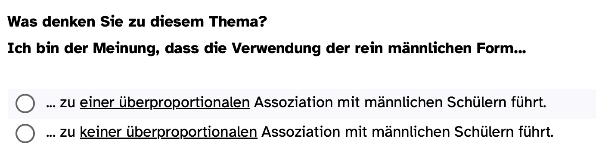
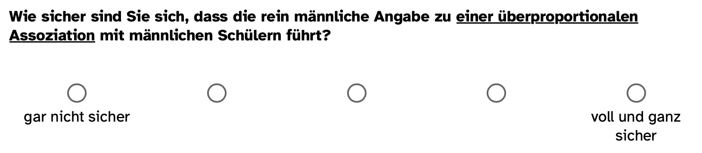

## Liveexperiment {.center .smaller}
> Bitte bearbeiten Sie das Liveexperiment (Masterarbeit) unter [https://ogy.de/mvl-25](https://ogy.de/mvl-25), anhand dessen Ergebnisse wir die Inhalte wiederholen werden.

{fig-align="center" width="400px"}

## Design {.smaller}
Jeder Teilnehmende bekam von der Surveysoftware eine ganze Zahl zugelost. War diese gerade, wurde die Person Gruppe 1 zugewiesen, war diese ungerade Gruppe 2. Sie hat zum Ziel Evidenz für die Existenz des Confirmation Bias im Kontext der Lehrpersonenbildung zu generieren.

| Gruppe 1 | Gruppe 2 |
|------------------------------------|------------------------------------|
| Abfrage von zukünftigem Handeln, Überzeugung & Sicherheit der Überzeugung | Abfrage von zukünftigem Handeln, Überzeugung & Sicherheit der Überzeugung |
| Überzeugungs**konformes** Studienergebnis | Überzeungs**widriges** Studienergebnis |
| Abfrage von zukünftigem Handeln, Überzeugung & Sicherheit der Überzeugung | Abfrage von zukünftigem Handeln, Überzeugung & Sicherheit der Überzeugung |
| Soziodemographie | Soziodemographie |

Ist diese Studie ein Experiment/Quasiexperiment/Nicht-Experiment? Ist sie querschnittlich, längsschnittlich oder eine Trendstudie? Hat Sie eher hohe/niedrige interne/externe Validität? Wie könnte diese gesteigert/gesenkt werden?

## Materialien der Studie A {.smaller .scrollable}

> Schweitzer & May (2019) sind in einem bildungswissenschaftlichen Experiment mit Lehrkräften der Frage nachgegangen, ob das generische Maskulinum, also die Verwendung der männlichen Form eines Begriffs (z. B. Schüler), eher zu einer Nennung von männlichen Vornamen führt als die Verwendung der weiblichen und männlichen Form eines Begriffs (z. B. Schülerinnen und Schüler). Um diese Frage zu beantworten, wurden zufällig zwei Gruppen mit jeweils 179 Lehrkräften gebildet. Die eine Gruppe wurde gebeten, „die Vornamen ihrer vier leistungsstärksten Schüler im Mathematikunterricht" und die andere Gruppe „die Vornamen ihrer vier leistungsstärksten Schülerinnen und Schüler im Mathematikunterricht" zu benennen.

**Das Ergebnis:** **Diejenigen Lehrkräfte, die nach den Vornamen ihrer leistungsstärksten ‚Schüler' im Mathematikunterricht gefragt wurden, [nannten im Durchschnitt mehr männliche als weibliche Vornamen]{style="color:#8cd000"} als diejenigen, die nach ihren leistungsstärksten ‚Schülerinnen und Schülern' gefragt wurden.**

## Materialien der Studie B {.smaller .scrollable}

> Schweitzer & May (2019) sind in einem bildungswissenschaftlichen Experiment mit Lehrkräften der Frage nachgegangen, ob das generische Maskulinum, also die Verwendung der männlichen Form eines Begriffs (z. B. Schüler), eher zu einer Nennung von männlichen Vornamen führt als die Verwendung der weiblichen und männlichen Form eines Begriffs (z. B. Schülerinnen und Schüler). Um diese Frage zu beantworten, wurden zufällig zwei Gruppen mit jeweils 179 Lehrkräften gebildet. Die eine Gruppe wurde gebeten, „die Vornamen ihrer vier leistungsstärksten Schüler im Mathematikunterricht" und die andere Gruppe „die Vornamen ihrer vier leistungsstärksten Schülerinnen und Schüler im Mathematikunterricht" zu benennen.

**Das Ergebnis:** **Diejenigen Lehrkräfte, die nach den Vornamen ihrer leistungsstärksten ‚Schüler' im Mathematikunterricht gefragt wurden, [nannten im Durchschnitt gleich viele männliche und weibliche Vornamen]{style="color:#8cd000"} wie diejenigen, die nach ihren leistungsstärksten ‚Schülerinnen und Schülern' gefragt wurden.**

## Messinstrumente {.smaller}
Welches Skalenniveau würden Sie der Erfassung der Überzeugung zum Male Bias und der Entscheidungssicherheit dieser Überzeugung zuweisen?

:::: {.columns}

::: {.column width='50%'}

:::

::: {.column width='50%'}

:::

::::


```{r}
#| label: data import & wrangling
#| results: hide
#| echo: false
library(haven)
library(tidyverse)
library(ggforce)

eval(parse("https://survey.ph-karlsruhe.de/Ergebnisse-interpretieren/?act=45roJ44H17ugS6ByP6fLdyR1&vQuality&rScript", encoding="UTF-8"))

data_new <- ds %>% 
  mutate(start = ymd_hms(STARTED),
         CASE = as.numeric(CASE)) %>% 
  filter(start > ymd_hms("2025-07-21 00:00:00")) %>% 
  mutate(Eval_study_quali = as.numeric(DU16),
         Gruppe = ifelse(DU06 == 1, "Ü_konsistent", "Ü_widrig"),
         Group = ifelse(DU06 == 1, "Ü_konsistent", "Ü_widrig"),
         
         Belief_pre = DU03,
         Belief_pre_short = substr(DU03, 1, 15),
         Belief_pre_n = as.numeric(DU03) - 1,
         Handlungsabsicht_Change = as.numeric(DU13) - as.numeric(DU09),
         Sicherheit_pre = as.numeric(DU08)) %>% 
  select(Gruppe, Eval_study_quali, Belief_pre_n, Handlungsabsicht_Change,
         Sicherheit_pre)

data_old <- read_sav("data/data_confbias_alt.sav")%>%  #Block06-Wiederholung/
  mutate(Eval_study_quali = as.numeric(DU16),
         Gruppe = ifelse(DU06 == 1, "Ü_konsistent", "Ü_widrig"),
         Group = ifelse(DU06 == 1, "Ü_konsistent", "Ü_widrig"),
         
         Belief_pre = DU03,
         Belief_pre_short = substr(DU03, 1, 15),
         Belief_pre_n = as.numeric(DU03) - 1,
         Handlungsabsicht_Change = as.numeric(DU13) - as.numeric(DU09),
         Sicherheit_pre = DU08) %>% 
  select(Gruppe, Eval_study_quali, Belief_pre_n, Handlungsabsicht_Change,
         Sicherheit_pre)

data <- full_join(data_new, data_old)
```

 
## Verteilung {.smaller}
Die Gruppe, welche die überzeugungskonsistenten Ergebnisse angezeigt bekam zeigte folgende Verteilung auf das Item **"Wie sehr überzeugt Sie das Studienergebnis?"** (Antwortmöglichkeiten: *1 = Das Studienergebnis überzeugt mich gar nicht ... 5 = Das Studienergebnis überzeugt mich voll und ganz.*

:::: {.columns}

::: {.column width='50%'}
```{r}
#| fig-width: 5
#| fig-height: 4
ggplot(data, aes(Eval_study_quali)) + 
  geom_histogram(binwidth = 1) +
  theme_minimal() +
  labs(caption = "1 = Das Studienergebnis überzeugt mich gar nicht ... 5 = Das Studienergebnis überzeugt mich voll und ganz.") +
  ylab("Anzahl Antworten")
```
:::

::: {.column width='50%'}
> Wie schätzen Sie MW, Median, MAD ein und was bedeuten Sie in diesem Kontext?
:::

::::

## Mittelwertunterschied {.smaller}
Der gefundene Confirmation Bias kann wie folgt beschrieben werden:

:::: {.columns}

::: {.column width='50%'}
```{r}
#| fig-width: 5
#| fig-height: 4
ggplot(data %>% filter(!is.na(Gruppe )),
       aes(Gruppe, Eval_study_quali)) +
  geom_violin() +
  geom_sina() +
  stat_summary(
    color = "#8cd000",
    fun.data="mean_sdl",  fun.args = list(mult=1), 
    geom = "pointrange",  size = 0.4,
    position = position_dodge(0.17)
    ) +
  theme_minimal() +
  ggtitle("Confirmation Bias", "MW ± 1*SD") +
  labs(caption = "1 = Das Studienergebnis überzeugt mich gar nicht\n...\n5 = Das Studienergebnis überzeugt mich voll und ganz.")
```

:::

::: {.column width='50%'}
> Wie groß schätzen Sie Cohen's $U_1$ und Cohen's $d$ ein?

```{r}
#| results: hide

results_ttest <- t.test(Eval_study_quali ~ Gruppe, data)
```


> Unter Annahme der Null-Hypothese $MW_{konsistent} = MW_{widrig}$ ergibt sich ein $p$-Wert von $p < .05$. Was schlussfolgern Sie daraus?
:::

::::


## Korrelation
Im folgenden Plot sehen Sie einen Jitter Plot der eingeschätzten Sicherheit und der Änderung der Handlungsabsicht. 

:::: {.columns}

::: {.column width='40%'}
```{r}
#| fig-width: 5
#| fig-height: 4
ggplot(data, aes(Sicherheit_pre, Handlungsabsicht_Change)) +
  geom_jitter() +
  theme_minimal()
```
:::

::: {.column width='60%'}
 > Welches Person's $r$ erwarten Sie?
 
 > Welchen Bayes Faktor $BF_{01}$ erwarten Sie für die Nullhypothese $H_0:\; r=0$ und die Alternativhypothese $H_q:\; r>0$
:::

::::

```{r}
#| results: hide

library(BayesFactor)
correlationBF(data$Sicherheit_pre, data$Handlungsabsicht_Change)
```

## Gutschein Code
Der Gewinnercode (bis auf die letzten vier Zeichen) lautet:

```{r}
#| echo: true
set.seed(1893)
ds %>% 
  filter(!is.na(ZG03_01)) %>% 
  sample_n(1) %>%
  pull(ZG03_01) %>% 
  substr(., 1,8)
```


 
## Literatur

```{=html}
<style>
div.callout {border-left-color: #8cd000 !important;
</style>
```
